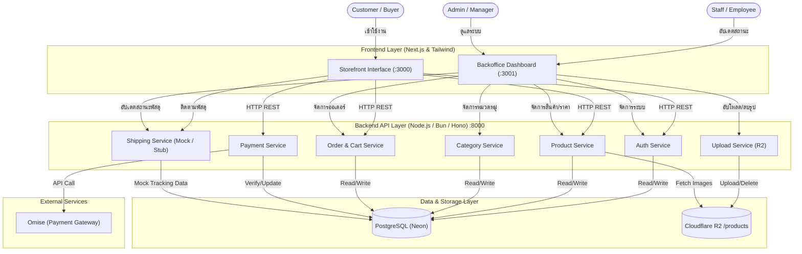

# 🛍️ Bare & Bold (Bracelet Marketplace)
**รายวิชา CSI204 ดิจิทัลแพลตฟอร์มสำหรับพัฒนาซอฟต์แวร์**
**ภาคการศึกษา:** 3 (Summer) **ปีการศึกษา:** 2568
**Domain:** e-Commerce

---

### 1. ข้อมูลกลุ่ม (Group Information)
**ชื่อกลุ่ม:** Bare & Bold (เดิม: Bracelet Marketplace)
**จำนวนสมาชิก:** 4 / 5 คน

| ลำดับ | รหัสนักศึกษา | ชื่อ-สกุล | หน้าที่รับผิดชอบ (Roles) |
| :---: | :--- | :--- | :--- |
| 1 | 67095025 | ณภัทร พลดงนอก | Project Manager / System Analyst |
| 2 | 67136081 | ภาณุพัฒน์ อ่อนตา | Frontend Developer |
| 3 | 67150301 | สุพิชญาณ์ ชื่นชม | Backend Developer |
| 4 | 67146201 | ธราธร พัฒนพวงสิทธิ์ | Database Admin / Software Tester |
*(หมายเหตุ: หน้าที่รับผิดชอบสามารถปรับเปลี่ยนได้ตามความเหมาะสมของกลุ่ม)*

---

### 2. ชื่อโครงงาน (Project Title)
**ชื่อโครงงาน (ภาษาไทย):** ระบบร้านค้าออนไลน์และคัสตอมสร้อยข้อมือ Bare & Bold
**ชื่อโครงงาน (ภาษาอังกฤษ):** Bare & Bold (Custom Bracelet E-Commerce Platform)

---

### 3. หลักการและเหตุผล (Rationale)
เพื่อเป็นช่องทางในการขายสินค้าออนไลน์ให้กับทางแบรนด์ Bare & Bold รวมถึงช่วยให้ลูกค้าสามารถสั่งสร้อยข้อมือคัสตอม (Made-to-Order) เฉพาะบุคคลได้ง่ายขึ้น โดยเลือกตกแต่งชิ้นส่วนอะไหล่ (Accessories เช่น จี้, ลูกปัด, เชือก) ตามความต้องการ พร้อมทั้งมีระบบหลังบ้านช่วยบริหารจัดการคำสั่งซื้อ สต็อกสินค้า และการจัดส่งได้อย่างเป็นระบบและมีประสิทธิภาพ

---

### 4. วัตถุประสงค์ของโครงงาน (Objectives)
เพื่อพัฒนาโครงงานระบบร้านค้าออนไลน์และคัสตอมสร้อยข้อมือ Bare & Bold ตามกระบวนการพัฒนาซอฟต์แวร์ (SDLC) ดังนี้:
1. **Requirement Analysis & Planning:** วิเคราะห์ความต้องการและกำหนดขอบเขตระบบร้านค้าออนไลน์และการคัสตอมสร้อยข้อมือเฉพาะบุคคลของแบรนด์ Bare & Bold เพื่อตอบสนองความต้องการของผู้ใช้ในระบบได้ครบถ้วน
2. **System & Database Design:** ออกแบบสถาปัตยกรรมระบบ โครงสร้างฐานข้อมูลเชิงสัมพันธ์ (PostgreSQL) และออกแบบประสบการณ์ผู้ใช้งาน (UI/UX) ทั้งส่วนหน้าร้าน (Storefront) และระบบหลังบ้าน (Backoffice)
3. **System Development:** พัฒนาระบบด้วย Next.js และ Hono API ที่มีประสิทธิภาพ เชื่อมต่อระบบชำระเงิน Omise Payment Gateway และจำลองระบบขนส่งพัสดุด้วย Mock Shipping API ได้อย่างถูกต้องปลอดภัย
4. **System Testing:** ดำเนินการทดสอบฟังก์ชันการทำงานหลัก (Functional Testing) และทดสอบ UAT ร่วมกับผู้ใช้งาน เพื่อป้องกันข้อผิดพลาดและความไม่ปลอดภัยของข้อมูลธุรกรรมการซื้อขาย
5. **Deployment & Maintenance:** ติดตั้งระบบซอฟต์แวร์บนสภาพแวดล้อมจริงเพื่อเปิดบริการ และทำเอกสารข้อมูลจำเพาะเชิงเทคนิค (System Specification Doc) สำหรับนำมาใช้อ้างอิงเพื่อบำรุงรักษาและพัฒนาต่อยอดได้ง่าย

---

### 5. ขอบเขตของระบบ (System Scope)
ระบบได้รับการออกแบบเพื่อรองรับกลุ่มผู้ใช้งาน (Actors) 4 กลุ่มหลัก โดยมีรายละเอียดความสามารถของแต่ละกลุ่มดังนี้:

#### 1. ผู้ใช้ทั่วไป / ผู้เยี่ยมชม (Guest / Visitor)
* เรียกดูหน้าแรก (Browse Home Page)
* ค้นหาสินค้า (Search Products)
* ดูรายละเอียดสินค้า (View Product Details)

#### 2. ลูกค้า (Customer / Buyer)
* สมัครสมาชิก (Register) — *พร้อมระบบยืนยันตัวตนผ่านอีเมล/เบอร์โทร*
* เข้าสู่ระบบ (Login)
* จัดการข้อมูลส่วนตัว (Profile Management) — *พร้อมระบบแก้ไขข้อมูลส่วนตัว*
* ค้นหาสินค้า และดูรายละเอียดสินค้า (สินค้าพร้อมส่ง และสินค้า Made-to-Order)
* เพิ่มสินค้าลงตะกร้า (Add to Cart) — *พร้อมระบบคำนวณราคารวมอัตโนมัติ และการใช้โค้ดส่วนลด*
* จัดการตะกร้าสินค้า (Cart Management)
* สั่งซื้อสินค้า (Place Order) — *พร้อมระบบเลือกที่อยู่จัดส่ง และเลือกวิธีการชำระเงิน*
* ชำระเงิน (Payment) — *พร้อมระบบดูสถานะการจัดส่งพัสดุ*
* ติดตามคำสั่งซื้อ (Order Tracking)
* รีวิวสินค้า / ให้คะแนน (Product Review) — *พร้อมระบบแนบรูปภาพประกอบรีวิว*
* รายการโปรด (Wishlist)
* ติดต่อสอบถาม / แชทกับร้านค้า (Customer Support Chat)

#### 3. พนักงาน (Staff)
* จัดการสินค้า (Product Management) — *เพิ่มสินค้า, แก้ไขสินค้า, ลบสินค้า*
* จัดการหมวดหมู่สินค้า (Category Management)
* จัดการคำสั่งซื้อ (Order Management) — *ตรวจสอบ/ยืนยันคำสั่งซื้อ, อัปเดตสถานะการสั่งซื้อ, ยกเลิกคำสั่งซื้อ*
* จัดการการจัดส่ง (Shipping Management) — *อัปเดตเลขพัสดุและจัดเตรียมการขนส่ง*
* จัดการรีวิว / คำติชม (Review Management)

#### 4. ผู้จัดการ (Manager / Admin)
* **ครอบคลุมสิทธิ์การทำงานทั้งหมดของพนักงาน (Staff)**
* จัดการลูกค้า (Customer Management) — *ตรวจสอบและจัดการสถานะบัญชีลูกค้า*
* จัดการโปรโมชั่น / ส่วนลด (Promotion & Discount Management)
* ดูรายงานและสถิติ (Reports & Analytics Dashboard) — *แสดงยอดขายและสถิติต่างๆ แบบเรียลไทม์*
* จัดการเนื้อหาเว็บไซต์ (Content Management System)
* ตั้งค่าระบบ (System Settings)

---

### 6. แนวทางการพัฒนาตาม SDLC (System Development Life Cycle)
1. **Planning:** วิเคราะห์ความต้องการและกำหนดขอบเขตของ Bracelet Marketplace
2. **Analysis:** วิเคราะห์กระบวนการทำงานและจำลองระบบ (Use Case, ER-Diagram)
3. **Design:** ออกแบบสถาปัตยกรรมระบบ ฐานข้อมูล และหน้าจอผู้ใช้งาน (UI/UX)
4. **Development:** เขียนโปรแกรมส่วน Frontend และ Backend รวมถึงเชื่อมต่อ API
5. **Testing:** ทดสอบการทำงานของฟังก์ชันต่างๆ และแก้ไขข้อผิดพลาด
6. **Deployment:** นำระบบขึ้นเผยแพร่ (Deploy) ให้ใช้งานได้จริง
7. **Maintenance:** บำรุงรักษาและปรับปรุงระบบตามข้อเสนอแนะ

---

### 7. เครื่องมือและเทคโนโลยีที่ใช้ (Tools & Technologies)
**Frontend (Storefront):** พอร์ต `:3000`
- [x] React / Next.js 15
- [x] Tailwind CSS
- [x] hugeicons-react (ไอคอน)

**Backoffice:** พอร์ต `:3001`
- [x] React / Next.js 15
- [x] Tailwind CSS
- [x] react-easy-crop (ครอบตัดรูปภาพ 1:1 ก่อนอัปโหลด)

**Backend:** พอร์ต `:8000`
- [x] Node.js (รันด้วย Bun Runtime + Hono Framework)
- [x] Prisma ORM (ระบบ Migration สำหรับอัปเดตโครงสร้างฐานข้อมูล)

**Database & Storage:**
- [x] PostgreSQL (Neon Serverless)
- [x] Cloudflare R2 (จัดเก็บรูปภาพสินค้า แยกโฟลเดอร์ `/products`)

**External Services / APIs:**
- [x] Omise (แพลตฟอร์มรับชำระเงิน / Payment Gateway)
- [x] Mock Shipping API (การทำ Stub เพื่อจำลองระบบขนส่ง)

**Design Tool:**
- [x] Figma
- [x] อื่นๆ: Mermaid Diagram

**Version Control:**
- [x] Git
- [x] GitHub
- [x] SourceTree

---

### 8. แนวทางการทดสอบระบบ (Testing Approach)
**ประเภทการทดสอบ (Test Types):**
- [x] Functional Testing
- [x] User Acceptance Testing (UAT)

**เครื่องมือที่ใช้ (Tools):**
- [x] Postman (สำหรับทดสอบ API)
- [x] Manual Testing (ทดสอบการทำงานของระบบด้วยตนเองตามฟังก์ชันที่พัฒนา)

**รายละเอียดการทดสอบ:**
ทดสอบระบบตะกร้าสินค้า การสั่งซื้อ การทำงานของการชำระเงิน (ทดสอบการเรียกใช้งาน API ของ Omise) และการจัดการสถานะออเดอร์ (ทดสอบผ่าน Mock Shipping) รวมถึงทดสอบการเรียกใช้งาน API ฝั่ง Backend ผ่าน Postman เพื่อตรวจสอบความถูกต้องของข้อมูล (Response Status) [2, 3]

### 9. ผลลัพธ์ที่คาดว่าจะได้รับ (Expected Outcomes)
1. ได้ระบบร้านค้าออนไลน์ (E-Commerce) ที่ใช้งานได้จริงสำหรับจำหน่ายกำไลข้อมือและข้อเท้าของแบรนด์ Bare & Bold
2. ร้านค้ามีระบบหลังบ้านในการจัดการสินค้าคัสตอม สต็อก และติดตามออเดอร์ได้อย่างครบวงจร
3. ลูกค้าสามารถเลือกชมสินค้า สั่งคัสตอม ชำระเงินได้อย่างปลอดภัย และติดตามสถานะการจัดส่งได้สะดวก
4. ได้เอกสารวิเคราะห์และออกแบบระบบที่ถูกต้องตามมาตรฐานการพัฒนาซอฟต์แวร์

---

### 10. แผนการดำเนินงาน 4 สัปดาห์ (Work Plan: 4 Weeks)
| สัปดาห์ (Week) | กิจกรรม (Activities) | รายละเอียดโดยย่อ (Brief Description) |
| :---: | :--- | :--- |
| **1** | วิเคราะห์และออกแบบระบบ (Analysis & Design) | รวบรวมความต้องการ ออกแบบ Use Case, ER-Diagram และ UI/UX |
| **2** | พัฒนา Frontend (Frontend Development) | พัฒนาหน้าจอผู้ใช้ (Buyer) และหน้าระบบหลังบ้าน (Backoffice) |
| **3** | พัฒนา Backend และฐานข้อมูล (Backend & Database Development) | สร้าง API จัดการสินค้า, เชื่อมต่อ Omise API สำหรับชำระเงิน และทำ Mock Shipping |
| **4** | ทดสอบระบบและนำเสนอผลงาน (Testing & Presentation) | ทำ Manual Testing/UAT ตรวจสอบบัค และเตรียมพรีเซนต์โปรเจกต์ |

---
# 📊 Analysis & Design Document: Bare & Bold (Custom Bracelet E-Commerce Platform)

เอกสารฉบับนี้จัดทำขึ้นเพื่อแสดงการวิเคราะห์และออกแบบสถาปัตยกรรมระบบ (System Architecture) สำหรับโครงงาน "Bare & Bold" ซึ่งเป็นระบบ e-Commerce
---

## 1. ขอบเขตของระบบ (System Scope)
ระบบได้รับการออกแบบเพื่อรองรับกลุ่มผู้ใช้งาน (Actors) 4 กลุ่มหลัก โดยมีรายละเอียดความสามารถของแต่ละกลุ่มดังนี้:

### 1. ลูกค้า 
* สมัครสมาชิก (Register) 
* เข้าสู่ระบบ (Login)
* จัดการข้อมูลส่วนตัว (Profile Management) 
* ค้นหาสินค้า และดูรายละเอียดสินค้า (สินค้าพร้อมส่ง และสินค้า Made-to-Order)
* เพิ่มสินค้าลงตะกร้า (Add to Cart) 
* จัดการตะกร้าสินค้า (Cart Management)
* สั่งซื้อสินค้า (Place Order) 
* ชำระเงิน (Payment) 
* ติดตามคำสั่งซื้อ (Order Tracking)
* รีวิวสินค้า / ให้คะแนน (Product Review) 
* รายการโปรด (Wishlist)
* ติดต่อสอบถาม / แชทกับร้านค้า (Customer Support Chat)

### 2. พนักงาน (Staff)
* จัดการสินค้า (Product Management) 
* จัดการหมวดหมู่สินค้า (Category Management)
* จัดการคำสั่งซื้อ (Order Management) 
* จัดการการจัดส่ง (Shipping Management) 
* จัดการรีวิว / คำติชม (Review Management)

### 3. ผู้จัดการ (Manager / Admin)
* **ครอบคลุมสิทธิ์การทำงานทั้งหมดของพนักงาน (Staff)**
* จัดการลูกค้า (Customer Management) 
* จัดการโปรโมชั่น / ส่วนลด (Promotion & Discount Management)
* ดูรายงานและสถิติ (Reports & Analytics Dashboard) 
* จัดการเนื้อหาเว็บไซต์ (Content Management System)
* ตั้งค่าระบบ (System Settings)

---

## 2. หลักการออกแบบสถาปัตยกรรมซอฟต์แวร์ (Software Architectural Design Principles)
การออกแบบระบบยึดหลักการสำคัญเพื่อรองรับการขยายตัว (Scalability) และการบำรุงรักษา (Maintainability) ดังนี้:
* **Separation of Concerns (SoC):** แบ่งแยกหน้าที่ความรับผิดชอบของระบบออกเป็นเลเยอร์อย่างชัดเจน ได้แก่ ส่วนหน้า (Frontend Storefront พอร์ต :3000), ส่วนบริหารจัดการ (Backoffice พอร์ต :3001), ส่วนประมวลผลหลัก (Backend พอร์ต :8000) และระบบฐานข้อมูล (Database) เพื่อไม่ให้โค้ดผูกติดกันจนเกินไป
* **Loose Coupling:** การเชื่อมต่อระหว่าง Frontend และ Backend จะทำผ่าน RESTful API
* **Testability:** ระบบออกแบบให้ทดสอบได้ง่าย โดยเฉพาะระบบขนส่งที่มีการใช้ **Mock Objects (Stub)** เข้ามาจำลองการทำงานของระบบขนส่งภายนอก เพื่อให้สามารถทดสอบระบบอัปเดตสถานะพัสดุได้โดยไม่ต้องพึ่งพาระบบขนส่งจริง

---

## 3. การออกแบบสถาปัตยกรรมระบบ (System Architecture Design)
ระบบแบ่งออกเป็น 5 ส่วนหลัก ดังนี้:

### 3.1 Frontend Storefront (ส่วนติดต่อผู้ใช้งาน — ลูกค้า)
*   **แนวคิดการออกแบบ:** พัฒนาด้วยรูปแบบ Component-Based Architecture (SPA)
*   **เทคโนโลยีที่ใช้:** Next.js 15 (React) สำหรับโครงสร้างเว็บ และ Tailwind CSS สำหรับการตกแต่ง UI
*   **รายละเอียด:** หน้าแรก, รายการสินค้า (ดึงจาก API จริง), รายละเอียดสินค้า, ตะกร้าสินค้า, Checkout (Omise), ประวัติออเดอร์

### 3.2 Backoffice Dashboard (ส่วนบริหารจัดการ — พนักงาน/ผู้จัดการ)
*   **เทคโนโลยีที่ใช้:** Next.js 15 (React) + Tailwind CSS
*   **รายละเอียด:** จัดการสินค้า (เพิ่ม/แก้ไข/ลบ + กำหนดราคาเต็มและราคาลด), ครอบตัดรูปภาพสินค้า 1:1 ด้วย `react-easy-crop`, จัดการหมวดหมู่วัสดุตกแต่ง, อัปเดตสถานะออเดอร์

### 3.3 Backend Architecture (ส่วนประมวลผลหลัก)
*   **แนวคิดการออกแบบ:** ใช้สถาปัตยกรรมแบบให้บริการ API (RESTful API)
*   **เทคโนโลยีที่ใช้:** Node.js (รันด้วย Bun + Hono Framework) เพื่อประสิทธิภาพและความรวดเร็ว
*   **การแบ่งโมดูล (Services):**
    *   `Auth Service`: จัดการการสมัครสมาชิกและยืนยันตัวตน (JWT)
    *   `Product Service`: จัดการข้อมูลสินค้า ราคา และเชื่อมต่อกับ R2 สำหรับรูปภาพ
    *   `Category Service`: จัดการหมวดหมู่วัสดุตกแต่ง (Accessory Categories)
    *   `Upload Service`: อัปโหลด/ลบรูปภาพบน Cloudflare R2 แยกโฟลเดอร์ตามประเภท
    *   `Order Service`: ตะกร้าสินค้าและการสร้างใบสั่งซื้อ
    *   `Payment Service`: รับชำระเงินผ่านการเชื่อมต่อ API ของ Omise
    *   `Shipping Service (Mock/Stub)`: จัดการสถานะการจัดส่งแบบจำลอง

### 3.4 Database Architecture (ระบบจัดเก็บข้อมูล)
*   **Relational Database:** ใช้ **PostgreSQL (Neon Serverless)** จัดเก็บข้อมูลที่มีความสัมพันธ์กัน เช่น ข้อมูลบัญชีผู้ใช้ ออเดอร์ และรายละเอียดสินค้า
*   **ORM:** Prisma ORM (ใช้ระบบ **Prisma Migrations** สำหรับการอัปเดตโครงสร้างฐานข้อมูล)
*   **ตารางหลัก (Key Tables):** `User`, `Employee`, `Product` (รองรับ `price` + `originalPrice`), `ProductImage` (Position 0 คือรูปปก), `Category`, `Accessory`, `CustomOption`, `Cart`, `CartItem`, `Order`, `OrderItem`
*   **Cloud Storage:** ใช้ **Cloudflare R2** ในการเก็บไฟล์รูปภาพสินค้า แยกโฟลเดอร์ `/products` เพื่อลดภาระของฐานข้อมูลหลัก

### 3.5 External Services (บริการภายนอก)
*   **Payment Gateway:** เชื่อมต่อกับ **Omise API** เพื่อรับชำระเงินผ่านบัตรเครดิตและ PromptPay

---
## 4. System Architecture Diagram
ด้านล่างนี้คือแผนผังสถาปัตยกรรมระบบ (System Architecture) ของ Bare & Bold ที่แสดงการเชื่อมต่อระหว่าง Frontend, Backend และ Database

เอกสารเพิ่มตาม https://bareandbold.duckdns.org/docs
